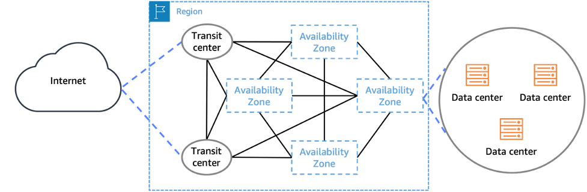

# Regions and Zones

## AWS Region

An AWS Region is like a big cluster of computer houses around the world. Each AWS Region consists of multiple independent and physically separate Availability Zones (AZ) within a geographic area. All Regions currently have three or more Availability Zones.

- AWS has Regions all around the world
- Regions have names like us-east-1, eu-west-3.
- Most AWS services are region-scoped
- A region is a cluster of data centers
- Each region has many Availability Zones (usually 3, minimum is 2, maximum is 6).
- The resources and data that you create in one Region do not exist in any other Region unless you explicitly use a replication or copy feature offered by an AWS service or replicate the resource yourself.

Example:

Region: Australia (Sydney) Region

Availability Zones:

1. ap-southeast-2a
2. ap-southeast-2b
3. ap-southeast-2c

### How do you choose an AWS Region?

it depends, on some factors that may impact your choice:

- **Compliance**: with data governance and legal requirements, data never leaves a region without your explicit permission. Some countries want their data to stay in their own country. For example, if you're in Brazil, you might need to use the Sao Paulo region.
- **Proximity to customers**: reduced latency. So if most of your users are going to be in America, it makes a lot of sense to deploy your application in America, close to your users, because they will have a reduced latency. If you deploy your application in Australia and your users are in America, they will have a lot of lag in using your app.
- **Available services within a Region**: new services and new features aren't available in every Region. Some regions do not have services. So if you're leveraging a service with your application you need to make sure you're deploying into is available and does have that services.
- **Pricing:** The cost can change based on the Region. Look at the service pricing page for details.

## Availability Zones

Availability Zones (AZ) consist of one or more physical data centers that are redundantly connected to each other and the internet.

AWS operates over 100 Availability Zones within several Regions around the world.

- An Availability Zone is one or more discrete data centers with independent and redundant power infrastructure, networking, and connectivity in an AWS Region;
- Availability Zones in a Region are meaningfully distant from each other, up to 60 miles (~100 km) so that they're isolated from disasters, but close enough to use synchronous replication with single-digit millisecond latency.
- They are designed to stay safe from common problems like power issues, water problems, earthquakes, fires, tornadoes, or floods.
- When AWS updates its services, deployments to Availability Zones in the same Region are separated in time to prevent correlated failure.
- All Availability Zones in a Region are interconnected with high-bandwidth, low-latency networking, over fully redundant, dedicated metro fiber. Each Availability Zone in a Region connects to the internet through two transit centers where AWS peers with multiple tier-1 internet providers.

These features provide strong isolation of Availability Zones from each other, which we refer to as Availability Zone Independence (AZI).

### AWS Point of Presence (Edge Locations)

In addition to the AWS Regions and Availability Zones, AWS also operates a globally distributed point of presence (PoP) network. These PoPs host Amazon CloudFront, a content delivery network (CDN); Amazon Route 53, a public Domain Name System (DNS) resolution service; and AWS Global Accelerator (AGA), an edge networking optimization service. The global edge network currently consists of over 410 PoPs, including more than 400 Edge Locations, and 13 regional mid-tier caches in over 90 cities across 48 countries

Each PoP is isolated from the others, which means a failure affecting a single PoP or metropolitan area does not impact the rest of the global network. The AWS network peers with thousands of Tier 1/2/3 telecom carriers globally, is well connected with all major access networks for optimal performance, and has hundreds of terabits of deployed capacity. Edge locations are connected to the AWS Regions through the AWS network backbone, a fully redundant, multiple 100GbE parallel fiber that circles the globe and links with tens of thousands of networks for improved origin fetches and dynamic content acceleration.

- Amazon has 400+ points of presence (400+ Edge Locations & 10+ Regional Caches) in 90+ cities across 40+ countries
- Content is delivered to end users with lower latency
