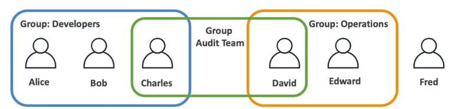

# IAM

IAM stands for Identity and Access Management and is a global service. in IAM we're going to create our users and assign them to groups and give them permissions to do certain things.

**Summary:**

- IAM = Identity and Access Management, Global Service.
- When we create an AWS account, a root account is created by default. This account has full admin access to everything in our account. We should never use this account for security reasons..
- Users are people within your organization, and can be grouped; Users are mapped to a physical user, has a password for AWS Console.
- Groups only contain users, not other groups, can't be nested.
- Users don't have to belong to a group, and a user can belong to multiple groups.
- Policies ⇒ JSON document that outlines permissions for users or groups
- Roles ⇒ for EC2 instances or AWS services
- Security ⇒ MFA + Password Policy
- Access Keys provide programmatic access to the AWS API, CLI, SDK, and other development tools.
- Audit ⇒ IAM Credential Reports & IAM Access Advisor



## IAM Permissions

Users or Groups can be assigned JSON documents called polices.

Example:

```json title="policy.json"
{
  "Version": "2012-10-17",
  "Statement": [
    {
      "Sid": "Stmt1234567890",
      "Effect": "Allow",
      "Action": ["s3:ListAllMyBuckets", "s3:GetBucketLocation"],
      "Resource": ["arn:aws:s3:::*"]
    },
    {
      "Sid": "Stmt1234567891",
      "Effect": "Allow",
      "Action": ["ec2:Describe*"],
      "Resource": ["*"]
    },
    {
      "Sid": "Stmt1234567892",
      "Effect": "Allow",
      "Action": [
        "cloudwatch:ListMetrics",
        "cloudwatch:GetMetricStatistics",
        "cloudwatch:Describe*"
      ],
      "Resource": ["*"]
    }
  ]
}
```

In the policy you define what a user or group is allowed to do in AWS.

Policies consists of:

- **Version:** policy language version, always include "2012-10-17"
- **Id:** an identifier for the policy (optional)
- **Statement:** one or more individual statements (required)
- Statements consists of:
  - **Sid:** and identifier for the statement (optional)
  - **Effect:** whether the statement allows or denies access (Allow/Deny)
  - **Principal:** account/user/role to which this policy applied to
  - **Action:** list of actions this policy allows or denies based on effect
  - **Resource:** list of resources to which the actions applied to
  - **Condition:** conditions for when this policy is in effect (optional)

It's recommended to apply the **least privilege principle**, which means that you should only give the minimum permissions required to do the job.

## Adding Admin User

By default when we create a new AWS account we'll have a root account, but it's not a best practice to use the root account for security reasons. So therefore, we want to create users such as admin users that will allow us to use our account more safely.

IAM ⇒ Users tab ⇒ Add Users:

- Provide a name;
- Select the option to allow access to the AWS Management Console;
- User type: IAM user;
- Console password ⇒ custom password
- Require password reset ⇒ doesn't need
- Next
- **Add user to group**
- Create a group => Admin
- Add the policy `AdministratorAccess`
- Tags ⇒ information's, ex: `Department: engineer`
- Now we can create the user.

### Login With IAM User

In the IAM Dashboard, we can define an alias for our account so users can login with the alias instead of the account id.

Go to IAM ⇒ Dashboard

In the right bar we have `Account Alias` where we can set an alias for our account. once updated, the sign-in url of our account will be updated to the alias.

Now we can login with the IAM user we created.

## Password Policy

Now that we have created users and groups, it's time for us to protect these users and groups from being compromised. For this, we can have two defense mechanism.

1. **Password Policy**
    - the stronger the password you use, the harder it is to crack it.
    - you can setup password policiy with different options:

        1. Minimum password length
        2. Require specific character types (uppercase letters, number,...,)
        3. Allow all IAM users to change their own passwords
        4. Require users to change their passwordd after some time (password expiration)
        5. Prevent password re-use

2. **Multi Factory Authentication - MFA**
    - Users have access to your account and can possibly change configuration or delete resources in your AWS account.
    - You want to protect your Root Accounts and IAM users.
    - MFA = password you know + security device you own.
    - Main benefit of MFA: if a password is stolen or hacked, the account is not compromised because the hacker would need the security device to login. 

    MFA devices options in AWS:

      1. Virtual MFA device - Authenticate using a code generated by an app installed on your mobile device or computer. (Google Authenticator, Authy,...,)
      2. Universal 2nd Factor (U2F) security key - Authenticate using a physical key plugged into your computer's USB port. (YoubiKey by Yubico(3rd party))
      3. Hardware Key Fob MFA device - Authenticate using a code displayed on a hardware Time-based one-time password (TOTP) token. (Gemalto(3rd party),...,)

### Securing your Account

IAM ⇒ Account settings ⇒ Edit Password Policy

In the password policy options you can either use the `IAM default` or customize the settings to improve the security of our accounts.

To set up MFA, you need to click on your account name in the top right corner and select `Security Credentials`. There you can set up MFA for your account.

## How can users access AWS?

- To access AWS we have three options:
    1. AWS Management console ⇒ (Protected by password + MFA)
    2. AWS Command Line Interface (CLI) ⇒ Protected by access keys
    3. AWS Software Developer Kit (SDK) ⇒ Protected by access keys
- Access Keys are generated through the AWS console
- Users manage their own access key
- Access Keys are secret, just like password
    - Access Key ID ~= Username
    - Secret Access Key ~= Password

### AWS CLI

- AWS CLI is a tool that enables you to interact with AWS services using commands in your command line shell
- Direct access to the public APIs of AWS services
- Follow this guid to install: [docs.aws.amazon.com/cli](https://docs.aws.amazon.com/cli/latest/userguide/getting-started-version.html)

### AWS SDK

- AWS Software Development Kit (AWS SDK)
- Language-specific APIs (set of libraries)
- Enables you to access and manage AWS services programmatically
- Embedded within your application
- Supports
    - SDKs (JavaScript, Python, PHP, Go, Node.js,...)
    - Mobile SDKs (Android, iOS)
    - IoT Devices SDKs (Embedded C, Arduino,...)

### Creating Access Keys

_Note: we should never create access key for our root account for security reasons_

IAM ⇒ Users ⇒ Choose a user ⇒ Security credentials

  - In this tab we can create a access key
  - From your terminal:
      ```sh
      aws configure
      ```
  - You will be prompted to set the:
    - Access Key ID;
    - Secret Key
    - Region: ex: us-east-1
    - Default output format
  - Test:
      ```sh
      aws iam list-users
      ```

### AWS CloudShell

AWS CloudShell is a browser-based shell that makes it easy to securely manage, explore, and interact with your AWS resources using the AWS CLI and SDKs.

- Terminal in the cloud of AWS;
- Pre-authenticated with your console credentials;
- The environments also include the Python and Node runtimes;
- You can download files from CloudShell to your local machine, and also upload files from your local machine to CloudShell;
- The shell environment is based on Amazon Linux 2. You can store up to 1 GB of files per region in the home directory and they’ll be available each time you open a shell in the region.

Features:

- Timeouts & Persistence – Each CloudShell session will timeout after 20 minutes or so of inactivity, and can be reestablished by refreshing the window:
- Persistent Storage – Files stored within $HOME persist between invocations of CloudShell with a limit of 1 GB per region; all other storage is ephemeral. This means that any software that is installed outside of $HOME will not persist, and that no matter what you change (or break), you can always begin anew with a fresh CloudShell environment.
- Network Access – Sessions can make outbound connections to the Internet, but do not allow any type of inbound connections. Sessions cannot currently connect to resources inside of private VPC subnets, but that’s also on the near-term roadmap.
- Pricing – You can use up to 10 concurrent shells in each region at no charge. You only pay for other AWS resources you use with CloudShell to create and run your applications.

## IAM Roles for Services

- Some AWS services will need to perform actions on your behalf, on your account, for example:
    - EC2 instances need to be able to access S3 buckets;
    - Lambda functions may need to access DynamoDB tables (to read/write data);
    - And so on...
- So we need to assign permissions to AWS service with IAM Roles
- **IAM roles** is just like users, but they are not intended to be used by physical people, but instead they will be used by AWS services.

Role is a way to give AWS entities permissions to do stuff on AWS. As of now, we have 5 types of entities that can assume roles:

1. AWS Service => AWS services like EC2, Lambda, or others to perform actions in your account.
2. AWS Account => Entities in other AWS accounts belonging to you or a 3rd party to perform actions in your account.
3. Web Identity => Entities/Users federated by the specified external web identity provider (Amazon, Facebook, Google, or any OpenID Connect (OIDC)compatible provider) to perform actions in your account.
4. SAML 2.0 Federation => Users federated with SAML 2.0 from a corporate directory
5. Custom Trust Policy => Custom trust policy to enable others to perform actions;

### Example - EC2 Instance + IAM Access

The most common entity type for a Role is the `AWS Service`, which means that we're going to give permissions to an AWS service to perform actions in our account.

Example: EC2 instance needs to access to read IAM users.

IAM ⇒ Roles ⇒ Create Role

- Trusted entity ⇒ AWS Service
- Use case - Service ⇒ EC2
- Use case for the specified service => EC2

And now we can give the permissions to which services the EC2 will have access to.

- Attach permissions policies ⇒ `IAMReadOnlyAccess`
- Role name ⇒ `EC2-IAM-Read-Only`
- Create role

Trusted Entity:

```json
{
  "Version": "2012-10-17",
  "Statement": [
      {
          "Effect": "Allow",
          "Principal": {
              "Service": "ec2.amazonaws.com"
          },
          "Action": "sts:AssumeRole"
      }
  ]
}
```

this policy is saying, this role can be assumed by the ec2 service in our account.

Now, If you create an EC2 instance and assign this role to it, the EC2 instance will be able to read IAM users.

## IAM Security Tools

- IAM Credentials Report (account-level)
    - a report that lists all your account's users and the status of their various credentials.

- IAM Access Advisor (user-level)
    - Shows the service permissions granted to a user and when those services were last accessed.
    - You can use this information to revise your policies and see which permissions are not used and reduce the permission a user can get to be inline with the principle of the least privilege.

## IAM Best Practices

- Don't use the root account expect for AWS account setup
- One physical user = One AWS user
- Assign users to groups and assign permissions to groups
- Create a strong password policy
- Use and enforce the use of Multi Factor Authentication (MFA)
- Create and use Roles for giving permissions to AWS services
- Audit permission of your account with the IAM Credentials Report
