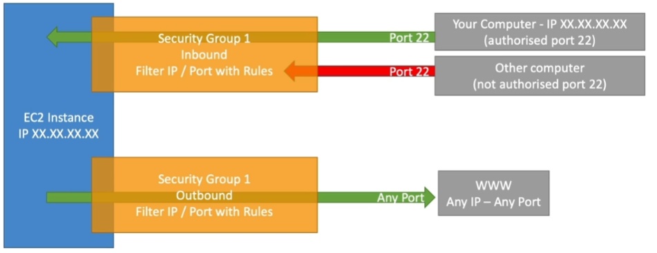
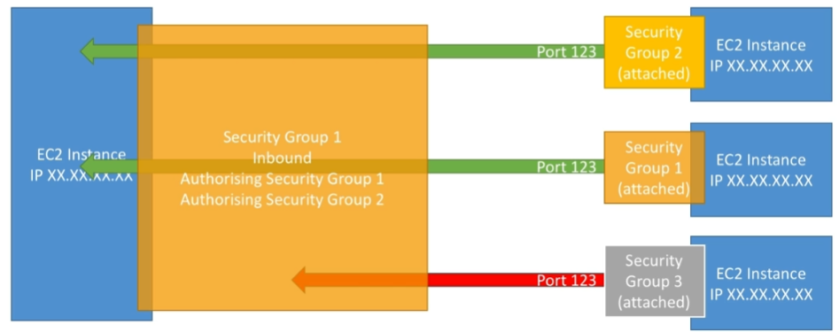

# EC2 Fundamentals

## Overview

- EC2- Elastic Compute Cloud = Infrastructure as a Service
- It's composed of many things at a high level. It mainly consists in the capability of:
    - Renting virtual machines (EC2)
    - Storing data on virtual drives (EBS)
    - Distributing load across machines (ELB)
    - Scaling the services using an auto-scaling group (ASG)

## EC2 Sizing & Configuration

- Operating System (OS): Linux, Windows or MacOS
- How much compute power & cores (CPU)
- How much random access memory (RAM)
- How much storage space:
    - Network attached (EBS & EFS)
    - Hardware attached (EC2 Instance Store)
- Network card: speed of the card, public IP address
- Firewall rules (security groups)
- Bootstrap script (configure at first launch): EC2 User Data
    - Used to run commands at first launch and automate tasks such as installing updates, softwares, downloading common files from the internet,...
    - It runs with the root user
    - The more you add to the bootstrap script, the longer it will take for the EC2 instance to start

You can choose pretty much how you want your Virtual Machine to be and you can rent it from AWS.

## Launching an EC2 Instance with a Web Server

EC2 => Instances => Launch Instance

- Name: MyWebServer
- AMI: Amazon Linux 2023 AMI (Free tier elegible)
- Instance Type: t2.micro (Free tier elegible)
- Create a new key pair so you can SSH into your instance
- Network Settings:
    - Default VPC
    - Subnet: No preference
    - Auto-assign Public IP: Enable
    - Security Group:
        - Create a new security group
        - Security group name: MyWebServer-SG
        - Description: Allow HTTP traffic
        - Inbound rules:
            - Type: HTTP
            - Source: Anywhere
- Use default storage settings (just make sure Delete on Termination is enabled)
- Advanced Details -> User Data
    - Add the following script:

    ```sh
    #!/bin/bash
    yum update -y
    yum install -y httpd
    systemctl start httpd
    systemctl enable httpd
    echo "<h1>Hello World from $(hostname -f)</h1>" > /var/www/html/index.html
    ```

- Launch the instance

When you open the public IP address of your instance in your browser, you should see the following message:
    
```html
<h1>Hello World from ip-172-31-22-123.ec2.internal</h1>
```

Now, if we're not using the EC2 instance anymore, we can Stop it to avoid being charged for it. If we want to use it again, we can Start it again.

- If we decide to stop an instance then AWS will not bill you for it.
- The instance state is kept because you have a volume attached to it.
- You can get rid of the instance by terminating it. This will delete the instance and the volume attached to it.
- If you stop an instance and start it again, AWS will give you a new public IP address.

## EC2 Instance Types

- You can use different types of EC2 instances that are optimised for different use cases. see: [https://aws.amazon.com/ec2/instance-types/](https://aws.amazon.com/ec2/instance-types/)
- AWS has the following naming convention: `m5.2xlarge`
    - m: instance class
    - 5: generation (AWS improves them over time)
    - 2xlarge: size within the instance class, the more the size, the more the CPU and Memory you get

- Compare instances types: [https://instances.vantage.sh/](https://instances.vantage.sh/)

### General Purpose

- These instances are ideal for applications that use these resources in equal proportions such as web servers and code repositories. 
- Great for a diversity of workloads.
- Balance between compute, memory and networking resources
- Use Cases:
    - Websites and web applications, development environments, build servers, code repositories, micro services, test and staging environments, and line of business applications.  

Some examples of general purpose instances are: `t2.micro`, `t2.small`, `t2.medium`, `m5.large`, `m5.xlarge`, `m5.2xlarge`, `m5.4xlarge`, `m5.12xlarge`, `m5.24xlarge`

### Compute Optimised

- Compute Optimized instances are ideal for compute bound applications that benefit from high performance processors.
- Great for compute-intensive tasks that require high performance processors
- Use Cases:
    - High performance web servers, scientific modelling, batch processing workloads, media transcoding, distributed analytics, high-performance computing (HPC), machine/deep learning inference, ad serving, dedicated gaming servers, and video encoding.

Some examples of compute optimised instances are: `c4.large`, `c5.large`, `c5.4xlarge`, `c5.metal`,...

### Memory Optimised

- Fast performance for workloads that process large data sets in memory (RAM).
- Use Cases:
    - Memory-intensive workloads such as open source databases, in-memory caches, and real-time big data analytics.
    - High performance, relational and NoSQL databases, distributed web scale cache stores, in-memory databases optimized for BI (Business Intelligence), applications performing real time processing of big unstructured data.

Some examples of memory optimised instances are: `r5.large`, `r5.4xlarge`, `x1.16xlarge`, `x1e.32xlarge`,...

### Accelerated Computing

- These instances use hardware accelerators, or co-processors, to perform some functions, such as floating point number calculations, graphics processing, or data pattern matching, more efficiently than is possible in software running on CPUs.
- Use Cases:
    - Generative AI applications, including question answering, code generation, video and image generation, speech recognition, and more.
    - Inferencing for ML models, including image and speech recognition, natural language processing, and recommendation engines.

Some examples of accelerated computing instances are: `p2.xlarge`, `p3.2xlarge`, `g3.4xlarge`, `g3.8xlarge`, `f1.2xlarge`,...

### Storage Optimised

- Great for storage-intensive task that require high, sequential read and write access to large data sets on local storage.
- They are optimized to deliver tens of thousands of low-latency, random I/O operations per second (IOPS) to applications.
- Use Cases:
    - High frequency online transaction processing (OLTP) systems, relational & NoSQL databases, caching for in-memory databases (Redis, Memcached), Data warehousing applications, distributed file systems.

Some examples of storage optimised instances are: `h1.2xlarge`, `i3.large`, `i3.4xlarge`,...

### HCP Optimised

- High performance computing (HPC) instances are purpose built to offer the best price performance for running HPC workloads at scale on AWS. HPC instances are ideal for applications that benefit from high-performance processors such as large, complex simulations and deep learning workloads.
- Use Cases:
    - computational fluid dynamics (CFD), weather forecasting, molecular dynamics, multiphysics simulations, finite element analysis (FEA) for crash simulations, seismic reservoir simulations, and structural simulations.

## Security Groups

- A security group is a virtual firewall that controls inbound and outbound traffic for your EC2 instances.
- It controls the traffic that is allowed to reach and leave the resources that it is associated with. For example, after you associate a security group with an EC2 instance, it controls the inbound and outbound traffic for the instance.
- Fundamental of network security in AWS
- Only contain `allow` rules
- Rules can reference by IP or by security group
- They regulate:
    - Access to Ports
    - Authorized IP ranges - IPv4 and IPv6
    - Control of inbound network (from other to the instance)
    - Control of outbound network (from the instance to the other)

Example:

| Type | Protocol | Port Range | Source |
| --- | --- | --- | --- |
| SSH | TCP | 22 | 122.1499.196.85/32 |
| HTTP | TCP | 80 | 0.0.0.0/0
| Custom TCP Rule | TCP | 3000 | sg-0a1b2c3d4e5f67890 |



Good to know:

- Can be attached to multiple instances
- An instance can have multiple security groups
- Locked down to a region/VPC combination, so if we change our vpc or region we need to create a new security group
- Live 'outside' the EC2 - if traffic is blocked the EC2 instance won't see it -- firewal outside the instance
- It's good to maintain one separate security group for SSH access
- If your application is not accessible (timeout), then it's a security group issue
- If your application gives a "connection refused" error, then it's an application error or it's not launched -- the SG actually worked, the traffic went through and the app was errored.
- By default, all inbound traffic is blocked and all outbound traffic is authorized

Security Groups can reference other security groups. This is good because it means we don't have to maintain IP addresses in our security groups for our applications to communicate with each other.

For example, if we have an EC2 instance (`EC2-1`) and it has a SG called `SG-1`, and this SG authorizes `SG-1` and `SG-2` inbounds. So if we launch another EC2 instance (`EC2-2`) and we attach `SG-2` to it, then `EC2-2` will be able to communicate with `EC2-1` in the port defined by the `SG-1` because `SG-2` is authorized in `SG-1`.




### Classic Ports to Know

- 22 = SSH (Secure Shell) - Log into a Linux instance
- 21 = FTP (File Transfer Protocol) - upload files into a file share
- 22 = SFTP (Secure File Transfer Protocol) - upload files using SSH
- 80 = HTTP - access unsecured websites
- 443 = HTTPS - access secured websites
- 3389 = RDP (Remote Desktop Protocol) - windows instance

## Adding Roles to EC2 Instances

Roles are a secure way to grant permissions to instances to access AWS services.

- Launch a Web Server EC2 instance
- In the Security Group, allow inbound traffic on port 22 from your IP address so that you can SSH into the instance.
- When the instance is launched, SSH into it:

    ```sh
    # Locate your private key file and Run this command, if necessary, to ensure your key is not publicly viewable.
    chmod 400 my-key.pem

    # Connect to your instance using its Public DNS:
    ssh -i "my-key.pem" ec2-user@ec2-34-230-32-123.compute-1.amazonaws.com
    ```

- Try to run the AWS command to list users:
```sh
$ aws iam list-users

Unable to locate credentials. You can configure credentials by running "aws configure".
```

- You should never use `aws configure` on an EC2 instance, it's not secure because the credentials are stored in the instance. Instead, we can use Roles.

- Go to IAM => Roles => Create Role `EC2-IAM-Read-Only` and attach the `IAMReadOnlyAccess` policy to it.
- Go to EC2 => Select your Instance => Actions => Security => Modify IAM Role => Select the role you just created

- Now, if you run the same command, it should work.

```sh
$ aws iam list-users

{
    "Users": [
        {
            "Path": "/",
            "UserName": "gabriel-brotas",
            "UserId": "...",
            "Arn": "...",
            "CreateDate": "...",
            "PasswordLastUsed": "..."
        }
    ]
}
```