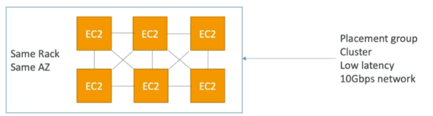
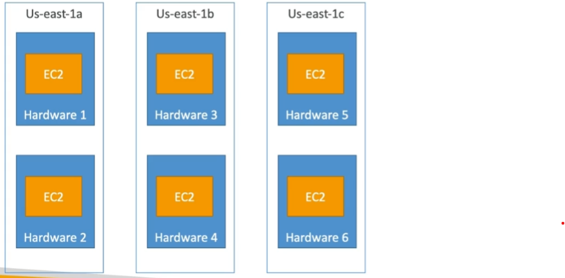
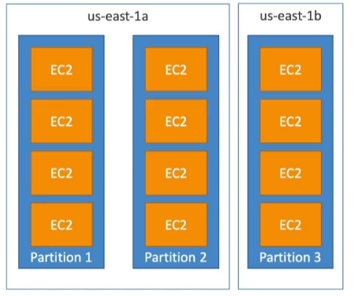
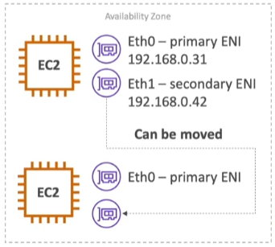
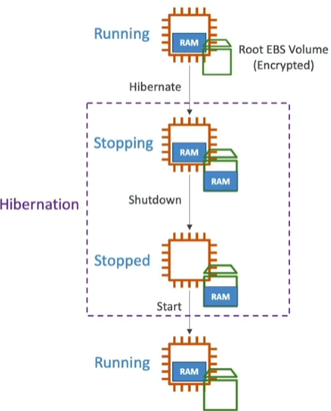

# EC2 Fundamentals - Part 2

## Instances Private vs Public IP vs Elastic IP

- Public IP: 
    - Can be accessed from the internet
    - Is unique across the whole web
    - The public IP will change every time you stop and start the instance
    - If your instance is stopped, you will lose the public IP
- Private IP:
    - Can only be accessed within the private network
    - Is unique across the private network
    - The private IP of your instance will not change during its lifetime, meaning that even if you stop and start the instance, it will keep the same private IP
    - If your instance is stopped, you will not lose the private IP
- Elastic IP:
    - Is a public IPv4 IP you own, and is yours until you release it.
    - You can attach an Elastic IP to an instance, and detach it whenever you want
    - AWS charges you a small hourly charge if the Elastic IP address is not associated with a running instance, or if it is associated with a stopped instance or an unattached network interface. While your instance is running, you are not charged for one Elastic IP address associated with the instance, but you are charged for any additional Elastic IP addresses associated with the instance.
    - When associated to an Instance, you have to specify a private IP address to associate the Elastic IP with.

## Placement Groups

To meet the needs of your workload, you can launch a group of *interdependent* EC2 instances into a placement group to influence their placement.

- Allows you to influence the placement of instances within the AWS infrastructure.
- That strategy can be defined using placement groups.
- When you create a placement group, you specify one of the following strategies for the group
    - **Cluster** 
        - Packs instances close together inside an Availability Zone.
        - This strategy enables workloads to achieve the low-latency network performance necessary for tightly-coupled node-to-node communication that is typical of high-performance computing (HPC) applications.
        - clusters instances into a low latency group in a single availability zone (high performance and high risk)
    - **Spread** - Spreads instances across underlying hardware (max 7 instances per group per AZ) - critical applications
    - **Partition** - Spreads instances across many different partitions (which rely on different sets of racks/hardware) within an AZ. Scales to 100s of EC2 instances per group(Hadoop, Cassandra, Kafka)
- There is no charge for creating a placement group.

- **Rack**: A rack is a physical unit within an AWS data center that contains a group of servers, networking equipment, and other hardware components. These components within a rack share some common physical characteristics and resources.

### Cluster

- Logical grouping of instances within a single Availability Zone.
- All the EC2 instances are on the same rack, which means same hardware and it is in the same availability zone
- The EC2 instances are physically close together, which means low latency and high throughput
- Pros: Great network (10 Gbps bandwidth between instances), super low latency
- Cons: If the rack fails, all the instances fails at the same time
- use case:
    - Big Data job that needs to complete fast
    - Application that needs extremely low latency and high network throughput and we're ok if there is a risk of simultaneous failure

### Spread

- A spread placement group is a group of instances that are each placed on distinct hardware.
- Spread placement groups are recommended for applications that have a small number of critical instances that should be kept separate from each other.
- All EC2 instances are going to be located on different hardware
- Pros:
    - Can span across multiple AZ
    - Reduced risk of simultaneous failure
    - EC2 Instances are on different physical hardware
- Cons:
    - Limited to 7 instances per AZ per placement group
- Use Case:
    - Application that needs to maximize high availability
    - Critical applications where each instance must be isolated from failure from each other

### Partition

- Partition placement groups help reduce the likelihood of correlated hardware failures for your application.
- No two partitions within a placement group share the same racks, allowing you to isolate the impact of hardware failure within your application.
- A partition placement group can have partitions in multiple Availability Zones in the same Region.
- Up to 7 partitions per AZ.
- Up to 100s of EC2 instances.
- The instances in a partition do not share racks with the instances in the other partitions -- isolated from failure.
- A partition failure can affect many EC2 but won't affect other partitions.
- EC2 instances get access to the partition information as metadata.
- Use cases:
    - large distributed and replicated workloads, such as HDFS, HBase, Cassandra, Kafka.

## Elastic Network Interface (ENI)

- Logical component in a VPC that represents a virtual network card
- You can attach to an EC2 instance in the same AZ.
- Each ENI lives within a particular subnet of the VPC (and hence within a particular Availability Zone)
- The ENI can have the following attributes:
    - Primary private IPv4, one or more secondary IPv4
    - One Elastic IP (IPv4) per private IPv4
    - One public IPv4
    - One or more security groups
    - A MAC address
- You can create ENI independently and attach them on the fly (move them) on EC2 instances for failover
- It provides networking capabilities to your EC2 instances, allowing them to communicate with other instances, services, and the internet.
- You can attach one or more ENIs to an EC2 instance.
- Each ENI is assigned a private IP address from the IP address range of your VPC, and it can also be associated with an Elastic IP address for public access.
- ENIs are associated with security groups and network access control lists (ACLs) to control inbound and outbound traffic.
- ENIs are often used to enhance the high availability and redundancy of applications by attaching them to instances in different Availability Zones or by moving them between instances.
- When an EC2 instance is terminated, the attached ENIs are automatically detached, and their IP addresses are released.

## EC2 Hibernate

- We know we can stop, terminate instances:
    - Stop - the data on disk (EBS) is kept intact in the next start
    - Terminate - the data on disk (EBS) is destroyed

- On start, the following happens:
    - First start: the OS boots & the EC2 User Data script is run
    - Following starts: the OS boots up
    - Then your application starts, caches get warmed up, and that can take time because you're booting up from scratch

- Hibernate is a feature that enables you to launch instances from a hibernation snapshot.
- When you hibernate an instance, Amazon EC2 signals the operating system to perform hibernation (suspend-to-disk). Hibernation saves the contents from the instance memory (RAM) to your Amazon Elastic Block Store (Amazon EBS) root volume. Amazon EC2 persists the instance's EBS root volume and any attached EBS data volumes. When your instance is started:
    - The EBS root volume is restored to its previous state
    - The RAM contents are reloaded
    - The processes that were previously running on the instance are resumed
    - Previously attached data volumes are reattached and the instance retains its instance ID
- The in-memory (RAM) state is preserved
- The instance boot is much faster (the OS is not stopped/restarted)
- Under the hood, the RAM state is written to a file in the root EBS volume.
- The root EBS volume must be encrypted.
- You are charged for storage of any EBS volumes, including storage for the RAM contents.
- Use cases:
    - Long-running processing.
    - Saving the RAM starte.
    - Services that take time to initialize
- Good to Know:
    - Instance RAM size must be less than 150GB.
    - Not supported for bare metal instances.
    - Root volume must be EBS, encrypted, not instance store, and large.
    - An instance can not be hibernated for more than 60 days.