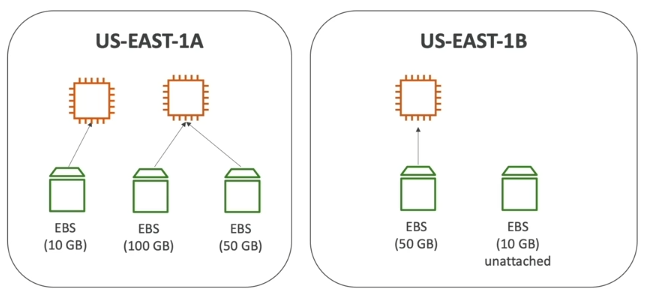
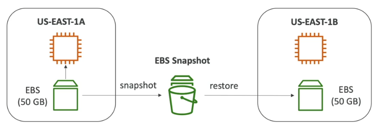

# EC2 Storage & AMI

## Overview

- An EBS (Elastic Block Store) Volume is a network drive you can attach to your instances while they run.
- It allows your instances to persist data, even after their termination.
- They can only be mounted to one instance at a time.
- They are bound to a specific Availability Zone.
    - To move a volume across, you first need to snapshot it.
- Free tier: 30GB of free EBS storage of type General Purpose (SSD) or Magnetic per month
- Analogy: Think of them as a "network USB stick" that you can take from a computer and put it into another one.
- It's a network drive (i.e. not a physical drive)
    - It uses the network to communicate the instance, which means there might be a bit of latency.
    - It can be detached from an EC2 instance and attached to another one quickly.
- Have a provisioned capacity (size in GBs, and IOPS)
    - You get billed for all the provisioned capacity, not the used capacity.
    - You can increase the capacity of the drive over time.

- EC2 Delete on Termination attribute for EBS Volumes:
    - By default, the root EBS volume of an instance will be deleted upon termination.
    - But, for other volumes (non-root), the default is to keep the EBS volume.
    - This can be controlled by the AWS console / AWS CLI

## EBS Snapshots

- Make a backup of your EBS volume at a point in time.
- Not necessary to detach volume to do snapshot, but recommended
- Can copy snapshots across availability zones or region
- Ex: we can create a snapshot of a volume in `us-east-1a` and then restore this volume from another region like `us-east-1b`

Features:
    - EBS Snapshot Archive
        - Move a Snapshot to an "archive tier" that is 75% cheaper.
        - Takes within 24 to 72 hours for restoring the archive.
    - Recycle Bin for EBS Snapshots
        - Setup rules to retain deleted snapshots so you can recover them after an accidental deletion.
        - Specify retention (from 1 day to 1 year)
    - Fast Snapshot Restore (FST)
        - Allows you to get your volumes restored in a few seconds.
        - Force full initialization of snapshot to have no latency on the first use ($$$)

## AMI - Amazon Machine Image

- AMI are customization of an EC2 instance
    - You add your own software, configuration, operating system, monitoring...
    - Faster boot / configuration time because all your software is pre-packaged
- AMI are built for a specific region (and can be copied across regions)
- You can launch EC2 instances from:
    - A Public AMI: AWS provided
    - Your own AMI: you make and maintain them yourself
    - An AWS Marketplace AMI: an AMI someone else made and published

### Creating an AMI

