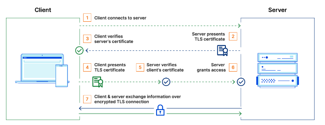

# TLS, SSL, mTLS, HTTP, HTTPS

## **What is TLS?**

Transport Layer Security, or TLS, is a widely adopted **security protocol designed to facilitate privacy and data security for communications over the Internet.** A primary use case of TLS is encrypting the communication between web applications and servers, such as web browsers loading a website. TLS can also be used to encrypt other communications such as email, messaging, and voice over IP (VoIP)

TLS, which was formerly called SSL, authenticates the server in a client-server connection and encrypts communications between client and server so that external parties cannot spy on the communications.

There are three important things to understand about how TLS works:

**1. Public key and private key**

TLS works using a technique called public key cryptography, which relies on a pair of keys — a public key and a private key. Anything encrypted with the public key can be decrypted only with the *private* key.

Therefore, a server that decrypts a message that was encrypted with the public key proves that it possesses the private key. Anyone can view the public key by looking at the domain's or server's TLS certificate.

**2. TLS certificate**

A TLS certificate is a data file that contains important information for verifying a server's or device's identity, including the public key, a statement of who issued the certificate (TLS certificates are issued by a certificate authority), and the certificate's expiration date.

**3. TLS handshake**

The TLS handshake is the process for verifying the TLS certificate and the server's possession of the private key. The TLS handshake also establishes how encryption will take place once the handshake is finished.

### **How does mTLS work?**

Normally in TLS, the server has a TLS certificate and a public/private key pair, while the client does not. The typical TLS process works like this:

1. Client connects to server
2. Server presents its TLS certificate
3. Client verifies the server's certificate
4. Client and server exchange information over encrypted TLS connection


mTLS is not a different protocol. It is just an extension of the TLS standard.

In mTLS, however, both the client and server have a certificate, and both sides authenticate using their public/private key pair. Compared to regular TLS, there are additional steps in mTLS to verify both parties (additional steps in **bold**):

1. Client connects to server
2. Server presents its TLS certificate
3. Client verifies the server's certificate
4. **Client presents its TLS certificate**
5. **Server verifies the client's certificate**
6. **Server grants access**
7. Client and server exchange information over encrypted TLS connection



**Certificate authorities in mTLS**

The organization implementing mTLS acts as its own certificate authority. This contrasts with standard TLS, in which the certificate authority is an external organization that checks if the certificate owner legitimately owns the associated domain.

A "root" TLS certificate is necessary for mTLS; this enables an organization to be their own certificate authority. The certificates used by authorized clients and servers have to correspond to this root certificate. The root certificate is self-signed, meaning that the organization creates it themselves. (This approach does not work for one-way TLS on the public Internet because an external certificate authority has to issue those certificates.)

### **Why use mTLS?**

mTLS helps ensure that traffic is secure and trusted in both directions between a client and server. This provides an additional layer of security for users who log in to an organization's network or applications. It also verifies connections with client devices that do not follow a login process, such as Internet of Things devices.

mTLS prevents various kinds of attacks, including:

- **On-path attacks:** On-path attackers place themselves between a client and a server and intercept or modify communications between the two. When mTLS is used, on-path attackers cannot authenticate to either the client or the server, making this attack almost impossible to carry out.
- **Spoofing attacks:** Attackers can attempt to "spoof" (imitate) a web server to a user, or vice versa. Spoofing attacks are far more difficult when both sides have to authenticate with TLS certificates.
- **Credential stuffing:** Attackers use leaked sets of credentials from a data breach to try to log in as a legitimate user. Without a legitimately issued TLS certificate, credential stuffing attacks cannot be successful against organizations that use mTLS.
- **Brute force attacks:** Typically carried out with bots, a brute force attack is when an attacker uses rapid trial and error to guess a user's password. mTLS ensures that a password is not enough to gain access to an organization's network. (Rate limiting is another way to deal with this type of bot attack.)
- **Phishing attacks:** The goal of a phishing attack is often to steal user credentials, then use those credentials to compromise a network or an application. Even if a user falls for such an attack, the attacker still needs a TLS certificate and a corresponding private key in order to use those credentials.
- **Malicious API requests:** When used for API security, mTLS ensures that API requests come from legitimate, authenticated users only. This stops attackers from sending malicious API requests that aim to exploit a vulnerability or subvert the way the API is supposed to function.

### **Websites already use TLS, so why is mTLS not used on the entire Internet?**

For everyday purposes, one-way authentication provides sufficient protection. The goals of TLS on the public Internet are:

1. to ensure that people do not visit spoofed websites.
2. to keep private data secure and encrypted as it crosses the various networks that comprise the Internet.
3. to make sure that data is not altered in transit. One-way TLS, in which the client verifies the server's identity only, accomplishes these goals.

Additionally, distributing TLS certificates to all end user devices would be extremely difficult. Generating, managing, and verifying the billions of certificates necessary for this is a near-impossible task.

But on a smaller scale, mTLS is highly useful and quite practical for individual organizations, especially when those organizations employ a Zero Trust approach to network security. Since a Zero Trust approach does not trust any user, device, or request by default, organizations must be able to authenticate every user, device, and request every time they try to access any point in the network. mTLS helps make this possible by authenticating users and verifying devices.

## **What is the difference between TLS and SSL?**

TLS is the successor of SSL.

**TLS evolved from a previous encryption protocol called Secure Sockets Layer (SSL),** which was developed by Netscape. TLS version 1.0 actually began development as SSL version 3.1, but the name of the protocol was changed before publication in order to indicate that it was no longer associated with Netscape. Because of this history, **the terms TLS and SSL are sometimes used interchangeably.**

## **What is the difference between TLS and HTTPS?**

HTTPS is an implementation of TLS encryption on top of the HTTP protocol, which is used by all websites as well as some other web services. **Any website that uses HTTPS is therefore employing TLS encryption.**

## **What is HTTP?**

The Hypertext Transfer Protocol (HTTP) is the foundation of the World Wide Web, and is used to load web pages using hypertext links. HTTP is an application layer protocol designed to transfer information between networked devices and runs on top of other layers of the network protocol stack. A typical flow over HTTP involves a client machine making a request to a server, which then sends a response message.

### **What’s in an HTTP request?**

An HTTP request is the way internet communications platforms such as web browsers ask for the information they need to load a website. Each HTTP request made across the Internet carries with it a series of encoded data that carries different types of information. A typical HTTP request contains:

1. HTTP version type
2. a URL
3. an HTTP method
4. HTTP request headers
5. Optional HTTP body.

### **What is HTTPS?**

**Hypertext transfer protocol secure (HTTPS) is the secure version of HTTP,** which is the primary protocol used to send data between a web browser and a website. **HTTPS is encrypted in order to increase security of data transfer.** This is particularly important when users transmit sensitive data, such as by logging into a bank account, email service, or health insurance provider.

Any website, especially those that require login credentials, should use HTTPS. In modern web browsers such as Chrome, websites that do not use HTTPS are marked differently than those that are.

### **How does HTTPS work?**

**HTTPS uses an encryption protocol to encrypt communications. The protocol is called Transport Layer Security (TLS),** although formerly it was known as Secure Sockets Layer (SSL). This protocol secures communications by using what’s known as an asymmetric public key infrastructure. This type of security system uses two different keys to encrypt communications between two parties:

1. **The private key -** this key is controlled by the owner of a website and it’s kept, as the reader may have speculated, private. This key lives on a web server and is used to decrypt information encrypted by the public key.
2. The public key - this key is available to everyone who wants to interact with the server in a way that’s secure. Information that’s encrypted by the public key can only be decrypted by the private key.

### **Why is HTTPS important? What happens if a website doesn’t have HTTPS?**

**HTTPS prevents websites from having their information broadcast in a way that’s easily viewed by anyone snooping on the network.** When information is sent over regular HTTP, the information is broken into packets of data that can be easily “sniffed” using free software. This makes communication over the an unsecure medium, such as public Wi-Fi, highly vulnerable to interception. In fact, all communications that occur over HTTP occur in plain text, making them highly accessible to anyone with the correct tools, and vulnerable to on-path attacks.

With HTTPS, traffic is encrypted such that even if the packets are sniffed or otherwise intercepted, they will come across as nonsensical characters. Let’s look at an example:

**Before encryption:**

```
This is a string of text that is completely readable
```

**After encryption:**

```
ITM0IRyiEhVpa6VnKyExMiEgNveroyWBPlgGyfkflYjDaaFf/Kn3bo3OfghBPDWo6AfSHlNtL8N7ITEwIXc1gU5X73xMsJormzzXlwOyrCs+9XCPk63Y+z0=
```

In websites without HTTPS, it is possible for Internet service providers (ISPs) or other intermediaries to inject content into webpages without the approval of the website owner. This commonly takes the form of advertising, where an ISP looking to increase revenue injects paid advertising into the webpages of their customers. Unsurprisingly, when this occurs, the profits for the advertisements and the quality control of those advertisements are in no way shared with the website owner. HTTPS eliminates the ability of unmoderated third parties to inject advertising into web content.

### **How is HTTPS different from HTTP?**

Technically speaking, HTTPS is not a separate protocol from HTTP. It is simply using TLS/SSL encryption over the HTTP protocol. HTTPS occurs based upon the transmission of TLS/SSL certificates, which verify that a particular provider is who they say they are.

When a user connects to a webpage, the webpage will send over its SSL certificate which contains the public key necessary to start the secure session. The two computers, the client and the server, then go through a process called an SSL/TLS handshake, which is a series of back-and-forth communications used to establish a secure connection. To take a deeper dive into encryption and the SSL/TLS handshake.

### **How does a website start using HTTPS?**

Many website hosting providers and other services will offer TLS/SSL certificates for a fee. These certificates will be often be shared amongst many customers. More expensive certificates are available which can be individually registered to particular web properties.

## Refs

- [Cloudflare](https://www.cloudflare.com/learning/)
