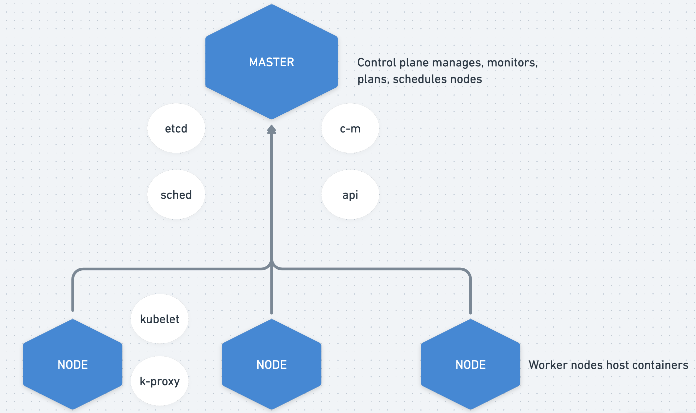

# Kubernetes

**Notes**

- K8S is made available through a set of APIs;
- We normally access the API using the CLI: **kubectl**;
- Everything is state based. You configure the state of each object;
- Kubernetes Master: Control the entire process of what the others node are going to do;
  - Kube-apiserver
  - Kube-controller-manager
  - Kube-scheduler
- Other Nodes:
  - Kubelet
  - Kubeproxy

### **Structure**



**Master(Control Plane) →** Manage the entire process; it must be high available;

- **Etcd →** Database, key value store for critical info, it stores the current state of the cluster, define which container is going to each node, what time they are getting loaded, etc;
- **Scheduler →** Decide which worker node will be best to deploy the next pods, it takes multiple factors in the scheduleing decision, such as resource requirements of the container, policy, data locality's, internal workload,…;
- **Controller Manager →** Ensures proper states of cluster components, configuration defined through a manifest file, ex: Desired State: 3 nodes, Current State: 2, it works to match the state requirements;
- **API** → Exposes kubernetes api, how we communicate with kubernetes master;

**Node(Data Plane) →** Host containers, ex: a ec2 can work as a node,

- **Kubelet →** Agent that runs in each node in the cluster, it makes sure the containers are running ok, verify the status of the node and containers to Control Plane, and, is how it communicate with the master node.

- **Kube Proxy →** How applications communicate with each other, it maintains network rules, this rules allows network communication to your conntainer from inside or outside of your cluster.

### **Components**

**Cluster:** Set of machines

**Pods:** Unit that contains the provisioned containers

Pod represents the process running on the cluster. Normally a pod represents a container but we can have more than one container running in the same pod (even though is not so commom)

**ReplicaSet:** it makes sure the desired amount of pods will be running, if a pod goes down it will create another one automatically

Ex:

```
B = Backend ⇒ 3 replicas
F = Frontend ⇒ 2 replicas
```

If we ask to add another Frontend Pod in the cluster and it has no more resources, the task will be pending until it has more computational resources or we create another node (cluster) to place this task on the next available node.

k8s is monitoring the health of clusters and pods to be able to recreate if they are no longer available

**Deployment:** Wrapper around replica set, it has the objective of provisioning the pods, it will define how many replicas we want from each Pod, but also it helps on the upgrade container version, scale, undo,…

Deployment will restore replicaset with running pods


```yaml
replicas: 3
...
minReadySeconds:
strategy:
	# when update the container image to a new version
	rollingUpdate:
		maxSurge: 1 # it will create a new pod with the new image version and when available it will remove the older version
		maxUnavailable: 0 # the update has to be done in such a way that there is at lest three pods running
	type: RollingUpdate

# 3 replicas + 1 maxSurge, a total of 4 pods at time
```

**Service**

Expose an application running on a set of pods as a network service.

Instead of a pod communicate with another using IP address it can use a service that distribute traffic to the pods.

Is a service discovery tool that also works as load balancer.

If a pod/node goes down this service will redirect the traffic for the new pods as well. it keeps track of new pods/nodes

It works with label selector.

Different types of service:

- **ClusterIP**
  Default type of service, only accessible from within cluster, if you are outside the cluster and you want to access the service you can't do it.
- **LoadBalancer**
  Cloud specific implementation, accessible from outside cluster, has dns name, ssl termination, WAF integration, Access Logs, Health Check, etc.
  when we run a 'kubectl get services' in a cloud provider the LoadBalancer type will generate an External IP to us so we can use this IP to access our service
- **Nodeport**
  Accessible from outside cluster, creates cluster wide pord. NodePort[30000-32767]
  ex: 10.16.10.01:32000, that way you can access your application

**Namespaces**

Isolated environment, we can group resources separately like a database, app1, app2, ...

## **EKS**

AWS manages the Control Plane(Master Node)

- AWS maintains high availability - Multiple EC2s in Multiple AZs
- Detects and replaces unhealthy control plane instances
- Scales control plane
- Maintain etcd
- Provides automated version upgrade and patching
- supports native and upstream kubernetes

**EKS Data Plane**

- **Amazon EC2 - Self Managed Node Groups**
  - You maintain worker EC2s
  - You orchestrate version upgrade, security patching, AMI Rehydration, keeping pods up during upgrade;
  - Can use custom AMI
- **Amazon EC2 - Managed Node Groups**
  - AWS manages worker EC2s
  - AWS provides AMI with security patches, version upgrade,...
  - AWS manages pod disruption during upgrade
  - Doesn't work with custom AMI
- **AWS Fargate**
  - No worker EC2 whatsoever !
  - You define and deploy pods
  - Container + Serverless
