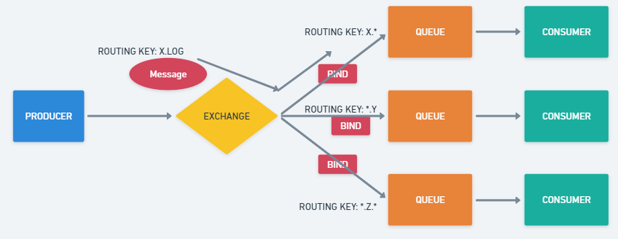

# RabbitMQ

RabbitMQ is an open-source message broker software, highly consolidated, used to work with communication between systems. Operating asynchronously, it acts as an intermediary that processes our messages between producers and consumers, in addition to having queues that have different forwarding options. It is widely used in distributed systems to enable communication between applications and services.

## **Features**

- Message Broker;
- Implements AMQP, MQTT, STOMP and HTTP;
- Developed in Erlang;
- Allow decoupling between services;
- Fast and Powerful; Stores data in memory;
- Durability, the messages can be stored in memory or on disk, depending on the configuration.
- Scalability
- Priority, which means that messages with higher priority are processed first.
- Many companies use it, well tested.

## **Under the Hood**

RabbitMQ is based on the message queue model, where messages are sent from producers (publishers) to consumers through a broker (RabbitMQ server).

It only opens a single persistent connection (which speeds up the process as it doesn't need to create TCP connections all the time) and then configures the channels (sub-connection) for consumers to retrieve the data they need;

1 Thread per channel; New thread for new channel;

**Basic Functioning:**

**Publisher ⇒** Publishes the message for whoever wants to consume it. It sends messages to an exchange, which routes the messages to the appropriate queue.

**Consumer ⇒** Retrieves messages from a queue.

**Queue ⇒** The Publisher does not send a message directly to the consumer. Instead, the message falls into a queue, and the consumer reads that queue of messages, and each message they read is deleted. Multiple consumers can be connected to the same queue, and messages are distributed to consumers in a round-robin fashion by default. Basically, is a routing agent that receives messages from producers and routes them to one or more queues.

**Exchange ⇒** Retrieves the message the publisher sent and discovers which queue the message will be sent to, because in some cases, the message may go to more than one queue.

**Flow:**

[Publisher] ⇒ [Exchange] ⇒ [Queue] ⇒ [Consumer]

The publisher publishes a message, the exchange redirects it to the queue(s), and the consumer listens to the queue to process the message and delete it afterwards.

## Types of Exchange

- **Direct**: The Exchange sends the message specifically to a certain queue
- **Fanout**: The exchange sends the message to all the queues that are binded/related to this exchange, if there are 10 related queues the message is sent to the 10 queues
- **Topic**: It has rules, e.g.: depending on the 'route key' it will forward to the queue we want.
- **Headers**: In the message header, we determine which queue we want the exchange to deliver to. It's not very common to use.

The system can have several exchanges with several queues and each queue can be related to one or more exchanges.

Playground: <http://tryrabbitmq.com/>

### Direct Exchange

Uses a message routing key to transport messages to queues. The routing key is a message attribute that the producer adds to the message header. You can consider the routing key to be an “address” that the exchange uses to determine how the message should be routed. A message is delivered to the queue with the binding key that exactly matches the message’s routing key

The direct exchange’s default exchange is “amq. direct“, which AMQP brokers must offer for communication

As is shown in the figure, queue A (create_pdf_queue) is tied to a direct exchange (pdf_events) with the binding key “pdf_create”. When a new message arrives at the direct exchange with the routing key “pdf_create”, the exchange sends it to the queue where the binding key = routing key; which is queue A in this example (create_pdf_queue).

The exchange binds the related queue with an exchange so it can forward the messages
The message passes the Routing Key and the Exchange redirects to the respective queue.

### Fanout Exchange

A fanout exchange, like direct and topic exchange, duplicates and routes a received message to any associated queues, regardless of routing keys or pattern matching. Here, your provided keys will be entirely ignored.

Fanout exchanges are useful when the same message needs to be passed to one or perhaps more queues with consumers who may process the message differently

- A single message goes to all queues;
- Does not have routing key;
- If we have several consumers consuming the same queue, RabbitMQ will create a kind of loadbalancer and send a distributed message to all

Ex: An e-commerce system has several sectors (purchase, marketing, invoice, log, ...)

If we want that when a user makes a purchase the message is sent to all queues we can use this model, the queues are connected in the exchange and we send the messages.

### Topic Exchange

Sends messages to queues depending on wildcard matches between the routing key and the queue binding’s routing pattern. Messages are routed to one or more queues based on a pattern that matches a message routing key.

- Routing keys have rules, similar to Regex; Ex: X.LOG, T.Y, ...

## **Queues**

- **FIFO ⇒** First In, First Out
  The message that enters first is the first to leave.
- **Properties:**
  - **Durable:** If it should be saved even after the broker restarts, persist on disk or keep it only in memory. If we restart the broker and the queue is not durable, it will be removed.
  - **Auto-delete:** Automatically removed when the consumer disconnects. If the consumer disconnects, the queue will be deleted.
  - **Expiry:** Defines the time that no messages or clients are consuming. For example, if no client is consuming this queue for 3 hours, it will be deleted.
  - **Message TTL:** Message's lifetime, if not consumed during this time, the message will be automatically removed.
  - **Overflow:**
    - Drop head (remove the oldest one), if it reaches the limit of messages for this queue and a new one arrives, remove the oldest one.
    - Reject publish, does not allow more inputs; will receive an error.
  - **Exclusive:** Only the channel that created it can access it.
  - **Max Length or bytes:** Maximum number of messages or maximum size in bytes allowed. For example, the queue can have a maximum of 10 messages. After that, it will fall under the overflow rule, or the queue can only have 2MB of messages.

### **Dead Letter Queues**

Some messages can't be delivered for any reason, no one read or processed them. After that, we can configure them to fall into a specific exchange that routes messages to a dead letter queue.

Such messages can be consumed and examined later.

### **Lazy Queues**

When the message flow is too large for consumers to process everything, and the RabbitMQ memory limit is reached, these messages are stored on disk to ensure that more messages can arrive and not be lost.

- It requires high I/O, so it is more costly.
- When there are millions of messages in a queue, for any reason, there is the possibility of freeing up memory by specifically moving the messages from the relevant queue to disk.

## **Reliability**

- How to ensure that messages will not be lost along the way?
- How to ensure that messages could be correctly processed by consumers?
- What if each message was worth 1 million dollars?

RabbitMQ features to solve such situations:

- **Consumer acknowledgement ⇒** consumer confirms receiving the message;
- **Publisher confirms ⇒** ensure that the message has reached the exchange;
- **Durable/persisted queues and messages ⇒** should not be used always because it costs memory and will slow down the system

**Types of Consumer Acknowledgement**

- Basic.Ack
  Every time we send a message to the consumer and it responds with "I received and processed the message"
- Basic.Reject
  If the consumer receives the message and can't resolve it (throw an exception), the message goes back to the queue because the consumer couldn't resolve it.
- Basic.Nack
  Same as Reject, but can reject more than one message at the same time.

**Publisher Confirms**

When we want to make sure that the message is going to the exchange,

In this case, the message has an ID (we pass this integer ID in the message, ex 1), when the message receives this message, it returns to the publisher saying it received the message with ID 1. **Ack: ID = 1**

If for some reason, the exchange has some internal problem, it will tell the publisher that it could not process the message, **Nack: ID = 1**

For important messages, we should use Publisher confirms.

## **Use Cases**

- Microservices: Used to enable communication between services. Each service can send and receive messages through RabbitMQ, which provides a scalable and reliable messaging solution.
- Real-time data processing: Can be used for real-time data processing, such as stream processing, event sourcing, and complex event processing (CEP). RabbitMQ can handle large volumes of messages and provide low-latency processing.
- Message-driven architecture: Messages can trigger actions in the system. For example, a message could trigger a workflow, a notification, or an update to a database.
- IoT: It can be used to enable communication between devices and services.

## Refs

- [rabbitmq-exchange-type](https://hevodata.com/learn/rabbitmq-exchange-type/#direct)
