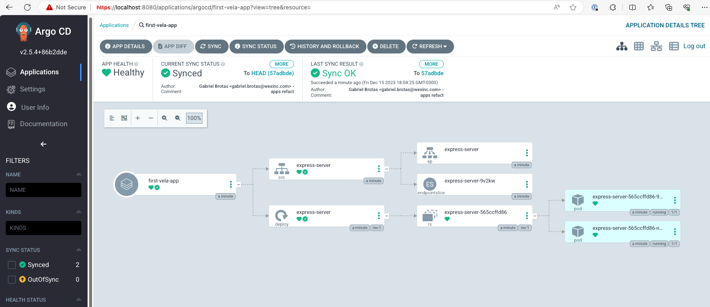

# Introduction

[Argo CD](https://github.com/argoproj/argo-cd/) is a GitOps continuous delivery tool for Kubernetes. It is a part of the CNCF Argo Project, a set of Kubernetes-native tools for running and managing jobs and applications on Kubernetes.

[KubeVela](https://github.com/kubevela/kubevela) is an open source application engine based on Kubernetes and OAM (Open Application Model). KubeVela is designed primarily for platform and operations teams to easily create simple yet highly extensible developer-facing abstractions on Kubernetes. This hides much of the complexity of configuring application manifests on Kubernetes such as scaling policies, deployment strategies and ingress from developers (aka end users) but allows platform teams to independently customize and control these configurations based on organizational policies.

In this guide, you'll learn how to integrate Argo CD and KubeVela.

## GitOps with Developer-centric Experience

### GitOps

Developers often want to focus on writing applications and pushing their code to Git repositories without being burdened by the complexities of configuring and running applications, especially in CI/CD pipelines. A popular approach on Kubernetes is to automatically deploy applications from Git to production, and this is where Argo CD comes into play. Argo CD continuously monitors Git repositories for new commits and automates the deployment process, applying pre-defined Kubernetes deployment manifest files to provision or upgrade applications running on Kubernetes. This practice, known as GitOps, is crucial for achieving continuous and automatic application delivery in the modern cloud-native stack, especially at Alibaba.

While GitOps is conceptually straightforward, there are key challenges when applying it to broader end-user scenarios.

- Complexity of Real-world Applications:

  - Production applications are complex, requiring developers to configure various types of Kubernetes resources.

- Learning Curve and Maintenance:

  - Developers face challenges in learning how to configure and maintain diverse objects, adhering to organizational security, compliance, and operational policies.
  - Misconfigurations can lead to deployment failures or service unavailability.

- Updates and Manifest Management:

  - Changes to Kubernetes specs or organizational policies necessitate updating all application manifests, a monumental task for organizations with numerous applications and extensive YAML files.

### KubeVela

Addressing these challenges, KubeVela is created as a minimal, extensible application engine designed to offer "PaaS-like" experiences on Kubernetes. KubeVela provides a simple and effective abstraction that separates application configuration concerns from platform and operational concerns.

Here is an example of the artifact, which is named `first-vela-app`:

```yaml
apiVersion: core.oam.dev/v1beta1
kind: Application
metadata:
  name: first-vela-app
spec:
  components:
    - name: express-server
      type: webservice
      properties:
        image: oamdev/hello-world
        ports:
          - port: 8000
            expose: true
      traits:
        - type: scaler
          properties:
            replicas: 2
```

By using `first-vela-app` and deploying it with Argo CD, developers just need to write a simple application config and push their code to git. Thier application will then be automatically deployed and start serving live traffic on the target Kubernetes cluster. Behind the scenes, platform and operations teams have the power to pre-define and/or modify the behavior of these abstractions with `CUElang` templates and ensure they meet organizational security, compliance and other operational requirements.

In the section below, we will explain how above GitOps workflow works in greater detail.

## KubeVela with Argo CD Step-by-Step

### Prerequisites

Tools:

- minikube==1.31.2
- helm==3.13.3
- kubectl==1.26.8

For the platform operator, the only “trick” is to enable KubeVela as a custom plugin to Argo CD so that it will “understand” OAM (Open Application Model) resources.

### 1. Run Minikube

```sh
minikube start --kubernetes-version=v1.28.3
```

### 2. Write the plugin configuration file

Argo CD allows integrating additional config management plugins like for Kubevela by configuring a plugin tool via a sidecar to the `repo-server`.

Plugins will be configured via a `ConfigManagementPlugin` manifest located inside the plugin container.

In our argocd helmchart, we have added the following plugin file to the path [`charts/argo-cd/templates/plugin.yaml/`](./charts/argo-cd/templates/plugin.yaml):

```yaml
---
apiVersion: v1
kind: ConfigMap
metadata:
  name: vela-config
data:
  plugin.yaml: |
    apiVersion: argoproj.io/v1alpha1
    kind: ConfigManagementPlugin
    metadata:
      name: vela
    spec:
      version: v1.0
      init:
        command: ["vela", "traits"]
      generate:
        command: ["sh"]
        args:
          - -c
          - |
            vela dry-run -f $ARGOCD_APP_NAME.oam.yml
      discover:
        find:
          glob: "**/*oam.yml"
```

This plugin is responsible for converting Kubevela OAM manifest definition to raw kubernetes object and ArgoCD should be responsible to deploy.

### 3. Register the plugin sidecar

To install a plugin, patch `argocd-repo-server` to run the plugin container as a sidecar, with `argocd-cmp-server` as its entrypoint.

Vela plugin runs the vela command to export manifest when the plugin is discovered on git manifest. Before initializing the plugin, we need to install Kubevela CLI to run the order successfully. The below configuration adds an init container to download the necessary CLI.

```yaml
argo-cd:
  repoServer:
    initContainers: # add vela cli
      - name: kubevela
        image: nginx:1.21.6
        command:
          - bash
          - "-c"
          - |
            #!/usr/bin/env bash
            set -eo pipefail
            curl -fsSl https://kubevela.io/script/install.sh | bash -s 1.9.7
        env:
          - name: VELA_INSTALL_DIR
            value: /custom-tools
        resources:
          limits:
            cpu: 50m
            memory: 64Mi
          requests:
            cpu: 10m
            memory: 32Mi
        volumeMounts:
          - name: custom-tools
            mountPath: /custom-tools
        terminationMessagePath: /dev/termination-log
        terminationMessagePolicy: File
        imagePullPolicy: IfNotPresent
    volumes:
      - name: custom-tools
        emptyDir: {}
      - configMap:
          name: vela-config
        name: vela-config
      - emptyDir: {}
        name: cmp-tmp
      - name: vela-cli-dir
        emptyDir: {}
```

after adding init container, we need to add our custom sidecar binary to run plugins properly. To use configmap plugin configuration in our sidecar, we need to mount configmap plugin to our pods

```yaml
argo-cd:
  repoServer:
    extraContainers: # add vela plugin
      - name: vela
        image: busybox
        command: [/var/run/argocd/argocd-cmp-server]
        args: ["--loglevel", "info"]
        securityContext:
          runAsNonRoot: true
          runAsUser: 999
        volumeMounts:
          - name: var-files
            mountPath: /var/run/argocd
          - name: plugins
            mountPath: /home/argocd/cmp-server/plugins
          - name: vela-config
            mountPath: /home/argocd/cmp-server/config/plugin.yaml
            subPath: plugin.yaml
          - name: cmp-tmp
            mountPath: /tmp
          - name: custom-tools
            mountPath: /usr/local/bin/vela
            subPath: vela
          - name: vela-cli-dir
            mountPath: /.vela

    volumes:
      - name: custom-tools
        emptyDir: {}
      - configMap:
          name: vela-config
        name: vela-config
      - emptyDir: {}
        name: cmp-tmp
      - name: vela-cli-dir
        emptyDir: {}
```

### 4. Install ArgoCD

Now we can deploy ArgoCD with the plugin:

```sh
helm repo add argo-cd https://argoproj.github.io/argo-helm
helm repo update
helm dep update charts/argo-cd/

helm install argo-cd charts/argo-cd/ -n argocd --values charts/argo-cd/values.yaml --create-namespace

# wait for argocd ready
kubectl wait pods --for=condition=Ready --timeout -1s --all -n argocd

# argocd ui
kubectl port-forward -n argocd service/argo-cd-argocd-server 8080:443
```

By now the vela plugin should have been registered and the `argo-repo-server` should have access to the vela cli to render the OAM files into Kubernetes resources.

Update ArgoCD password:

```sh
export PASS=$(kubectl --namespace argocd get secret argocd-initial-admin-secret \
    --output jsonpath="{.data.password}" \
    | base64 --decode)

argocd login localhost:8080 --insecure --username admin --password $PASS

argocd account update-password --current-password $PASS --new-password admin123

# login: admin
# password: admin123
```

### 5. Install KubeVela

Install KubeVela so that the `argo-repo-server` can render the OAM files into Kubernetes resources.

```sh
helm repo add kubevela https://kubevela.github.io/charts
helm repo update
helm dep update charts/kubevela/

helm install kubevela charts/kubevela/ -n vela-system --create-namespace

# wait for vela ready
kubectl wait pods --for=condition=Ready --timeout -1s --all -n vela-system
```

### 6. Use Argo CD with KubeVela

Now, acting as the application developer, you can deploy the app specified using KubeVela via GitOps.

In this case, we'll use the [`argocd-app`](./apps/argocd-app.yml) that will watch the git repository and apply the [`first-vela-app`](./apps/first-vela-app.oam.yml) to the local kubernetes cluster.

```sh
kubectl apply -f apps/argocd-app.yml
```



That’s it! Now you can create/modify OAM files, push to git, and Argo CD will automatically deploy them to your Kubernetes cluster, all via the magic of GitOps!

## Refs:

- https://argo-cd.readthedocs.io/en/stable/operator-manual/config-management-plugins/
- https://www.cncf.io/blog/2020/12/22/argocd-kubevela-gitops-with-developer-centric-experience/
- https://kubevela.io/blog/2023/01/06/kubevela-argocd-integration/

## Debug Plugin

You can debug the plugin by running the following command to print the logs of the `argo-repo-server` pod in the `vela` container:

```sh
kubectl logs -n argocd argo-cd-argocd-repo-server-7cdccb4499-mx59l -c vela
```
