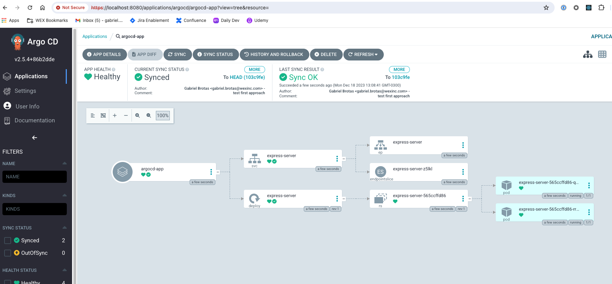
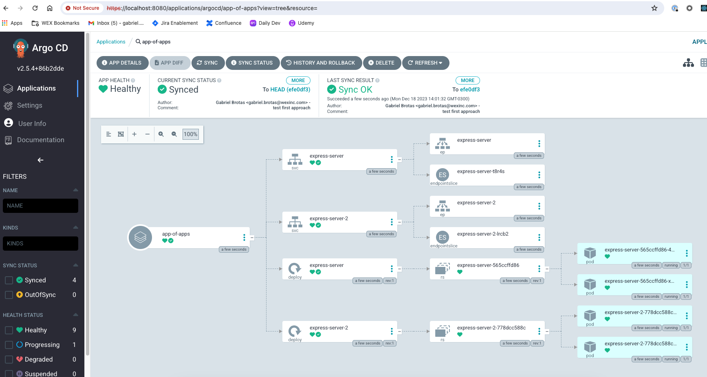

# 1. Vela dry-run approach

First approach is that without using Kubevela GitOps Controller, we can use ArgoCD as the GitOps Controller, which means ArgoCD applies a raw manifest to the target cluster. Kubevela provides us to export oam application components and traits to native Kubernetes resource therefore we can still use OAM based model and ArgoCD can manage resources with custom argo-repo-server plugin. Behind this approach that KubeVela and OAM can also works as a client side tool with the feature dry-run.

This part describe how ArgoCD apply dry-run mode on Kubevela resources.

## Prerequisites

Tools:

- minikube==1.31.2
- helm==3.13.3
- kubectl==1.26.8

For the platform operator, the only “trick” is to enable KubeVela as a custom plugin to Argo CD so that it will “understand” OAM (Open Application Model) resources.

_Note: All commands below are executed from this folder (`first-approach`)._

## 1. Run Minikube

```sh
minikube start --kubernetes-version=v1.28.3
```

## 2. Write the plugin configuration file

Argo CD allows integrating additional config management plugins like for Kubevela by configuring a plugin tool via a sidecar to the `repo-server`.

Plugins will be configured via a `ConfigManagementPlugin` manifest located inside the plugin container.

In our argocd helmchart, we have added the following plugin file to the path [`charts/argo-cd/templates/plugin.yaml/`](./charts/argo-cd/templates/plugin.yaml):

```yaml
---
apiVersion: v1
kind: ConfigMap
metadata:
  name: vela-config
data:
  plugin.yaml: |
    apiVersion: argoproj.io/v1alpha1
    kind: ConfigManagementPlugin
    metadata:
      name: vela
    spec:
      version: v1.0
      init:
        command: ["vela", "traits"]
      generate:
        command: ["sh"]
        args:
          - -c
          - |
            vela dry-run -f $ARGOCD_APP_NAME.oam.yml
      discover:
        find:
          glob: "**/*oam.yml"
```

This plugin is responsible for converting Kubevela OAM manifest definition to raw kubernetes object and ArgoCD should be responsible to deploy.

## 3. Register the plugin sidecar

To install a plugin, patch `argocd-repo-server` to run the plugin container as a sidecar, with `argocd-cmp-server` as its entrypoint.

Vela plugin runs the vela command to export manifest when the plugin is discovered on git manifest. Before initializing the plugin, we need to install Kubevela CLI to run the order successfully. The below configuration adds an init container to download the necessary CLI.

```yaml
argo-cd:
  repoServer:
    initContainers: # add vela cli
      - name: kubevela
        image: nginx:1.21.6
        command:
          - bash
          - "-c"
          - |
            #!/usr/bin/env bash
            set -eo pipefail
            curl -fsSl https://kubevela.io/script/install.sh | bash -s 1.9.7
        env:
          - name: VELA_INSTALL_DIR
            value: /custom-tools
        resources:
          limits:
            cpu: 50m
            memory: 64Mi
          requests:
            cpu: 10m
            memory: 32Mi
        volumeMounts:
          - name: custom-tools
            mountPath: /custom-tools
        terminationMessagePath: /dev/termination-log
        terminationMessagePolicy: File
        imagePullPolicy: IfNotPresent
    volumes:
      - name: custom-tools
        emptyDir: {}
      - configMap:
          name: vela-config
        name: vela-config
      - emptyDir: {}
        name: cmp-tmp
      - name: vela-cli-dir
        emptyDir: {}
```

after adding init container, we need to add our custom sidecar binary to run plugins properly. To use configmap plugin configuration in our sidecar, we need to mount configmap plugin to our pods

```yaml
argo-cd:
  repoServer:
    extraContainers: # add vela plugin
      - name: vela
        image: busybox
        command: [/var/run/argocd/argocd-cmp-server]
        args: ["--loglevel", "info"]
        securityContext:
          runAsNonRoot: true
          runAsUser: 999
        volumeMounts:
          - name: var-files
            mountPath: /var/run/argocd
          - name: plugins
            mountPath: /home/argocd/cmp-server/plugins
          - name: vela-config
            mountPath: /home/argocd/cmp-server/config/plugin.yaml
            subPath: plugin.yaml
          - name: cmp-tmp
            mountPath: /tmp
          - name: custom-tools
            mountPath: /usr/local/bin/vela
            subPath: vela
          - name: vela-cli-dir
            mountPath: /.vela

    volumes:
      - name: custom-tools
        emptyDir: {}
      - configMap:
          name: vela-config
        name: vela-config
      - emptyDir: {}
        name: cmp-tmp
      - name: vela-cli-dir
        emptyDir: {}
```

## 4. Install ArgoCD

Now we can deploy ArgoCD with the plugin:

```sh
helm repo add argo-cd https://argoproj.github.io/argo-helm
helm repo update
helm dep update charts/argo-cd/

helm install argo-cd charts/argo-cd/ -n argocd --values charts/argo-cd/values.yaml --create-namespace

# wait for argocd ready
kubectl wait pods --for=condition=Ready --timeout -1s --all -n argocd

# argocd ui
kubectl port-forward -n argocd service/argo-cd-argocd-server 8080:443
```

Confirm all services and pods are correctly running:

```sh
$ kubectl get pods -n argocd

NAME                                                      READY   STATUS    RESTARTS   AGE
argo-cd-argocd-application-controller-0                   1/1     Running   0          2m20s
argo-cd-argocd-notifications-controller-b59cb9585-ql92b   1/1     Running   0          2m21s
argo-cd-argocd-redis-5c5bc74fb7-s4xnj                     1/1     Running   0          2m21s
argo-cd-argocd-repo-server-6d6cb46867-g9blh               2/2     Running   0          2m21s
argo-cd-argocd-server-859c6bfbcc-l7vnc                    1/1     Running   0          2m21s
```

By now the vela plugin should have been registered and the `argo-repo-server` should have access to the vela cli to render the OAM files into Kubernetes resources.

Update ArgoCD password:

```sh
export PASS=$(kubectl --namespace argocd get secret argocd-initial-admin-secret \
    --output jsonpath="{.data.password}" \
    | base64 --decode)

argocd login localhost:8080 --insecure --username admin --password $PASS

argocd account update-password --current-password $PASS --new-password admin123

# login: admin
# password: admin123
```

## 5. Install KubeVela

Install KubeVela so that the `argo-repo-server` can render the OAM files into Kubernetes resources.

```sh
helm repo add kubevela https://kubevela.github.io/charts
helm repo update
helm dep update charts/kubevela/

helm install kubevela charts/kubevela/ -n vela-system --create-namespace

# wait for vela ready
kubectl wait pods --for=condition=Ready --timeout -1s --all -n vela-system
```

## 6. Use Argo CD with KubeVela

Now, acting as the application developer, you can deploy the app specified using KubeVela via GitOps.

In this case, we'll use the [`argocd-app`](./apps/argocd-app.yml) that will watch the git repository and apply the [`first-vela-app`](./apps/first-vela-app.oam.yml) to the local kubernetes cluster.

```sh
kubectl apply -f apps/argocd-app.yml
```



That’s it! Now you can create/modify OAM files, push to git, and Argo CD will automatically deploy them to your Kubernetes cluster, all via the magic of GitOps!

## Problems Found in this Approach

- **Dependency on ArgoCD Application resource names**: One problem with the current method is its reliance on the names of ArgoCD Application resources. The connection between OAM file names and corresponding ArgoCD Application resource names is rigid. Each OAM file must bear an identical name to the associated ArgoCD Application. This tight link is enforced by the following code snippet in the plugin logic:

  ```yaml
  data:
    plugin.yaml: |
      ...
      generate:
        command: ["sh"]
        args:
          - -c
          - |
            vela dry-run -f $ARGOCD_APP_NAME.oam.yml
  ```

  Here, `$ARGOCD_APP_NAME` represents the name of the ArgoCD Application resource ([argocd-app](./apps/argocd-app.yml)). Consequently, the plugin exclusively processes OAM files with matching names to their corresponding ArgoCD Applications. For example, if the ArgoCD app name is `name: first-vela-app`, the plugin will apply only the `first-vela-app.oam.yml` file to the cluster, ignoring other OAM or ArgoCD files.

- **Challenges with App-Of-Apps Concept**: The current approach encounters challenges when dealing with the app-of-apps concept. Even if you modify the plugin to apply all the OAM manifests in a directory to the clusters, ArgoCD interprets the OAM files as Kubernetes resources, not as ArgoCD Applications. To test this, consider updating the [plugin](./charts/argo-cd/templates/plugin.yaml) with the following logic:

  ```yaml
  data:
    plugin.yaml: |
      ...
      generate:
        command: ["sh"]
        args:
          - -c
          - |
            for file in $(find . -type f -name "*.oam.yml"); do
              vela dry-run -f $file
            done
  ```

  This new logic will iterate through all the `.oam.yml` files in the directory and apply them to the cluster.

  To implement these changes, update the [plugin.yaml](./charts/argo-cd/templates/plugin.yaml), and then run:

  ```sh
  helm upgrade argo-cd charts/argo-cd/ -n argocd
  ```

  Then, delete the `argo-repo-server` pod to refresh the plugin:

  ```sh
  # replace the pod name with your own
  kubectl delete pod -n argocd argo-cd-argocd-repo-server-6d6cb46867-6k6rz
  ```

  Wait for the pod to be ready again:

  ```sh
  kubectl wait pods --for=condition=Ready --timeout -1s --all -n argocd
  ```

  To ensure the repo server is using the new plugin, read the plugin config file from its pod:

  ```sh
  # replace the pod name with your own
  kubectl exec --stdin --tty -n argocd argo-cd-argocd-repo-server-6d6cb46867-92spj -c vela -- cat /home/argocd/cmp-server/config/plugin.yaml
  ```

  Now we can deploy the [app-of-apps](./app-of-apps/app-of-apps.yml) that will deploy multiple OAM files:

  ```sh
  kubectl apply -f app-of-apps/app-of-apps.yml
  ```

  

  As you can see, the `argo-repo-server` will render the OAM files into Kubernetes resources and they won't be treated as different ArgoCD Applications.

## Clean Up

```sh
minikube delete
```

## Refs:

- https://argo-cd.readthedocs.io/en/stable/operator-manual/config-management-plugins/
- https://www.cncf.io/blog/2020/12/22/argocd-kubevela-gitops-with-developer-centric-experience/
- https://kubevela.io/blog/2023/01/06/kubevela-argocd-integration/

## Debug Plugin

You can debug the plugin by running the following command to print the logs of the `argo-repo-server` pod in the `vela` container:

```sh
kubectl logs -n argocd argo-cd-argocd-repo-server-7cdccb4499-mx59l -c vela
```
