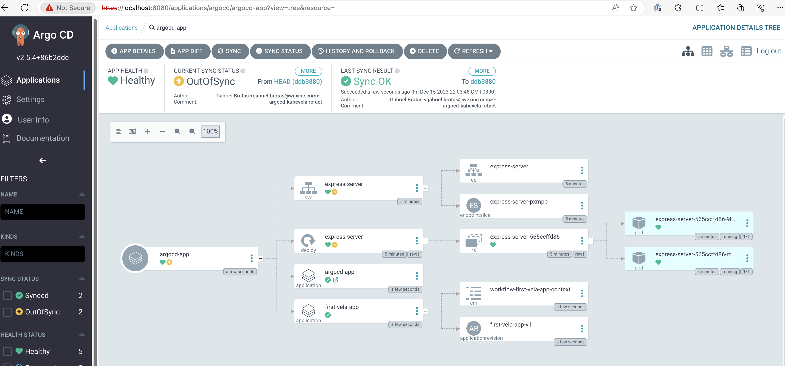

# 2. Kubevela Controller + ArgoCD Gitops syncer

Second approach is that we can use Kubevela gitops controller way as the server side and argocd can be our gitops syncer. This approach is flexible to use native kubevela feature set without using a custom plugin or dry run module. We just need to add below annotations to our OAM manifest repository to ignore outofsync.

```yaml
metadata:
  annotations:
    argocd.argoproj.io/compare-options: IgnoreExtraneous
```

This ArgoCD annotation controls the synchronization behavior of Kubernetes resources. It specifies that certain resources should be ignored during the comparison process when syncing an application. This is useful when you have resources that are generated by tools or processes and should not be considered as part of the application's overall synchronization status.

In essence, this annotation informs ArgoCD to ignore or exclude the annotated resource when comparing the desired state (as defined in your Git repository) with the current state in the cluster. The term "extraneous" indicates that these resources are considered additional or supplementary and should not affect the overall synchronization status of the application.

In practical terms, this annotation is helpful when managing dynamically generated resources or those handled outside of your Git repository. By using this annotation, you prevent ArgoCD from flagging these resources as differences during synchronization, providing a more accurate representation of the desired state for your application.

## Prerequisites

Tools:

- minikube==1.31.2
- helm==3.13.3
- kubectl==1.26.8

## 1. Run Minikube

```sh
minikube start --kubernetes-version=v1.28.3
```

## 2. Install ArgoCD

```sh
helm repo add argo-cd https://argoproj.github.io/argo-helm
helm repo update
helm dep update charts/argo-cd/

helm install argo-cd charts/argo-cd/ -n argocd --create-namespace

# wait for argocd ready
kubectl wait pods --for=condition=Ready --timeout -1s --all -n argocd

# argocd ui
kubectl port-forward -n argocd service/argo-cd-argocd-server 8080:443
```

Update ArgoCD password:

```sh
export PASS=$(kubectl --namespace argocd get secret argocd-initial-admin-secret \
    --output jsonpath="{.data.password}" \
    | base64 --decode)

argocd login localhost:8080 --insecure --username admin --password $PASS

argocd account update-password --current-password $PASS --new-password admin123

# login: admin
# password: admin123
```

## 3. Install KubeVela

```sh
helm repo add kubevela https://kubevela.github.io/charts
helm repo update
helm dep update charts/kubevela/

helm install kubevela charts/kubevela/ -n vela-system --create-namespace

# wait for vela ready
kubectl wait pods --for=condition=Ready --timeout -1s --all -n vela-system
```

## 4. Use Argo CD with KubeVela

Deploy the `argocd-app` so that ArgoCD can track the application resources.

```sh
kubectl apply -f ./apps/argocd-app.yml
```

In this example, ArgoCD tracks native Kubevela application resources and its revision.



## Problems Found in this Approach

- If you manually remove the OAM application resources (eg. deployment, service,...,) from the cluster (`kubectl delete pods`), ArgoCD will not recreate them even if you click to sync the application. This is because ArgoCD will think the app is already in sync with the gitops repo. This is not a good user experience.

- Sometimes when you try to delete the app from the UI ArgoCD just hangs there and does not delete the app. perhaps because ArgoCD is not able to delete the native Kubevela application resources ?

## Clean Up

```sh
kubectl delete -f apps/argocd-app.yml
helm uninstall argo-cd -n argocd
helm uninstall kubevela -n vela-system
```

## Refs:

- https://kubevela.io/blog/2023/01/06/kubevela-argocd-integration/
- https://argo-cd.readthedocs.io/en/stable/user-guide/compare-options/
