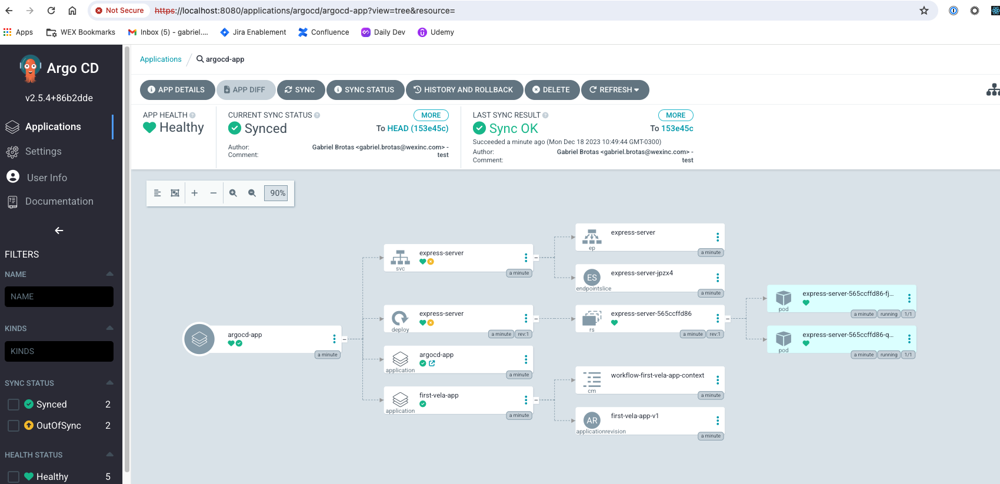

# 2. Kubevela Controller + ArgoCD Gitops syncer

Second approach is that we can use Kubevela gitops controller way as the server side and argocd can be our gitops syncer. This approach is flexible to use native kubevela feature set without using a custom plugin or dry run module. We just need to add below annotations to our manifest repository to ignore outofsync.

```yaml
argocd.argoproj.io/compare-options: IgnoreExtraneous
```

## Prerequisites

Tools:

- minikube==1.31.2
- helm==3.13.3
- kubectl==1.26.8

## 1. Run Minikube

```sh
minikube start --kubernetes-version=v1.28.3
```

## 2. Install ArgoCD

```sh
helm repo add argo-cd https://argoproj.github.io/argo-helm
helm repo update
helm dep update charts/argo-cd/

helm install argo-cd charts/argo-cd/ -n argocd --create-namespace

# wait for argocd ready
kubectl wait pods --for=condition=Ready --timeout -1s --all -n argocd

# argocd ui
kubectl port-forward -n argocd service/argo-cd-argocd-server 8080:443
```

Update ArgoCD password:

```sh
export PASS=$(kubectl --namespace argocd get secret argocd-initial-admin-secret \
    --output jsonpath="{.data.password}" \
    | base64 --decode)

argocd login localhost:8080 --insecure --username admin --password $PASS

argocd account update-password --current-password $PASS --new-password admin123

# login: admin
# password: admin123
```

## 3. Install KubeVela

```sh
helm repo add kubevela https://kubevela.github.io/charts
helm repo update
helm dep update charts/kubevela/

helm install kubevela charts/kubevela/ -n vela-system --create-namespace

# wait for vela ready
kubectl wait pods --for=condition=Ready --timeout -1s --all -n vela-system
```

## 4. Use Argo CD with KubeVela

Deploy the `argocd-app` so that ArgoCD can track the application resources.

```sh
kubectl apply -f ./apps/argocd-app.yml
```

In this example, ArgoCD tracks native Kubevela application resources and its revision.



## Clean Up

```sh
kubectl delete -f apps/argocd-app.yml
helm uninstall argo-cd -n argocd
helm uninstall kubevela -n vela-system
```

## Refs:

- https://kubevela.io/blog/2023/01/06/kubevela-argocd-integration/
